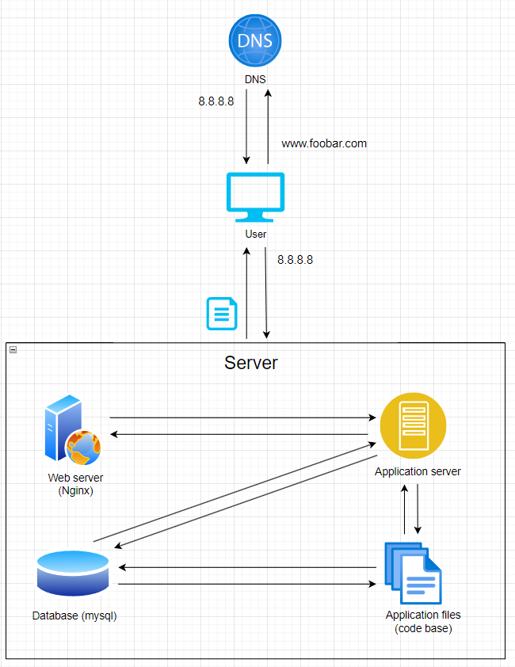

# About this infrastructure
## What is a server
a server is a computer only accessible by a network,and it provides functionality for other devices called clients.
## What is the role of the domain name
the domain name serves as human-readable text that represent an IP adresse of a server or website on the internet.
## What type of DNS record www is in www.foobar.com
www is a CNAME record
## What is the role of the web server
The role of the web server is to listen for HTTP requests from the user and return a response for each request.
## What is the role of the application server
The role of the application server is to execute the business logic of the application and communic1te with the database to retrieve or update data.
## What is the role of the database
The role of the database is storing and managing the web application's data
## What is the server using to communicate with the computer of the user requesting the website
the server is using the TCP (Transmission Control Protocol) to communicate with the user's computer.
# Issues with this infrastructure

## SPOF
## Downtime
## Scaling
