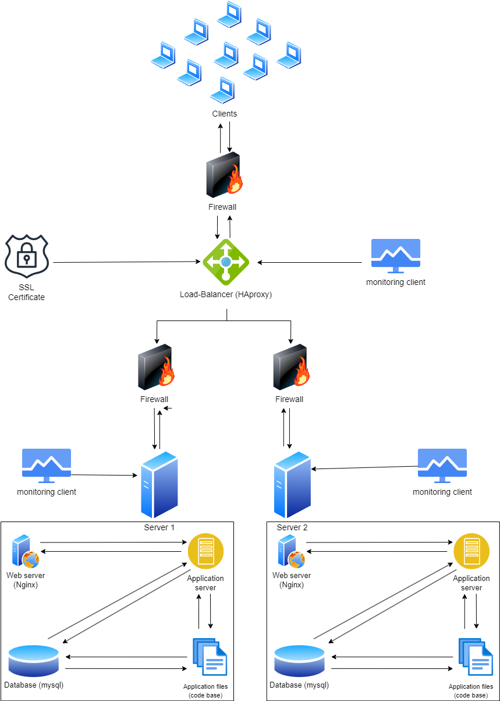

# Additional elements
- Firewalls
  - We added firewalls to prevent unauthorized access and protect against cyber threats.
- SSL Certificate (for HTTPS)
  - Encrypts data transmitted between clients and servers.
- Monitoring clients
  - Monitoring is used to track the performance, availability, and security of the infrastructure.
# Specifics about this infrastructure
- What are firewalls for?
  - Firewall 1 (Before Load Balancer):
    - Acts as the first line of defense at the network perimeter.
    - Controls and filters incoming traffic from external sources before it reaches the load balancer.
    - Enforces security policies and prevents unauthorized access.
  - Firewalls 2 and 3 (After Load Balancer):
    - Provide an additional layer of security within the internal network.
    - Control and monitor traffic between the load balancer and the internal servers.
    - Protect against unauthorized access and potential threats within the network.
